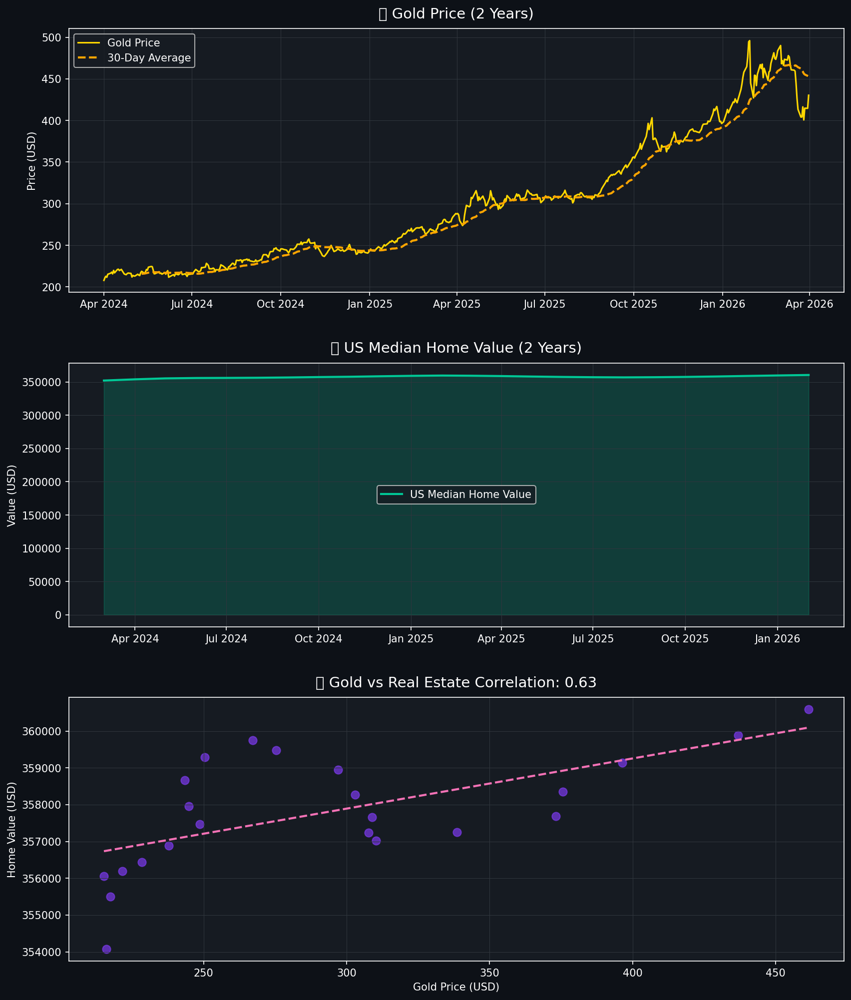

# 📈 MarketPulse — Gold & Real Estate Investment Analyzer

> A full end-to-end Data Science + Data Engineering project that fetches, analyzes, predicts, and visualizes gold and real estate market trends in a live interactive dashboard.

**Built by Soundarya Beathnabotla** | Data Science + Data Engineering  
[LinkedIn](https://linkedin.com/in/soundaryabeathnabotla) | [GitHub](https://github.com/SoundaryaBeathnabotla)

---

## 🚀 Live Dashboard Preview



---

## 🎯 What This Project Does

MarketPulse is an AI-powered investment analysis tool that helps investors understand two of the most popular alternative asset classes — **gold** and **luxury real estate**.

- 📥 **Fetches** real-time gold price data (GLD ETF via Yahoo Finance) and US real estate index data (Zillow ZHVI)
- 🔍 **Analyzes** price trends, volatility, and correlation between gold and real estate
- 🤖 **Predicts** short-term gold price movement using Machine Learning (Linear Regression + Random Forest)
- 📊 **Visualizes** everything in a professional dark-themed interactive Streamlit dashboard

---

## 🗂️ Project Structure

```
MarketPulse/
│
├── data/                          # Auto-generated after running W1
│   ├── gold_prices.csv            # 2 years of daily gold prices
│   └── real_estate_index.csv      # 2 years of US home value data
│
├── charts/                        # Auto-generated charts
│   ├── week2_analysis.png         # Trend + correlation charts
│   └── week3_predictions.png      # ML prediction charts
│
├── W1_fetch_data.py               # Fetch & clean data
├── W2_analyze.py                  # Trend analysis & correlation
├── W3_predict.py                  # ML price predictions
├── W4_dashboard.py                # Interactive Streamlit dashboard
│
├── requirements.txt
└── README.md
```

---

## How To Run

### 1. Clone the repo
```bash
git clone https://github.com/SoundaryaBeathnabotla/MarketPulse.git
cd MarketPulse
```

### 2. Install dependencies
```bash
pip install -r requirements.txt
```

### 3. Run in order

**Fetch Data:**
```bash
python W1_fetch_data.py
```

**Analyze Trends:**
```bash
python W2_analyze.py
```

**ML Predictions:**
```bash
python W3_predict.py
```

**Launch Dashboard:**
```bash
streamlit run W4_dashboard.py
```

---

## Requirements

```
yfinance
pandas
numpy
requests
matplotlib
scikit-learn
streamlit
plotly
```

---

## Machine Learning

Two models are trained and compared automatically:

| Model | Purpose |
|-------|---------|
| Linear Regression | Captures long-term trend |
| Random Forest | Captures non-linear patterns |

The best performing model is selected automatically to generate a **30-day gold price forecast** with confidence range.

**Features used:**
- 7-day and 30-day moving averages
- Price volatility (standard deviation)
- Previous day, 7-day, and 30-day prices
- Time index

---

## Dashboard Features

- **Live market metrics** — current gold price, period high/low, 30-day forecast
- **Interactive gold trend chart** — with 30-day moving average and forecast overlay
- **Model performance chart** — actual vs predicted prices
- **Gold vs Real Estate comparison** — dual-axis chart with correlation score
- **Forecast table** — daily predictions with % change from today
- **Adjustable settings** — change data period and forecast window

---

## Key Findings

- Gold has shown a strong upward trend over the past 2 years, rising from ~$210 to ~$495
- US real estate values have remained relatively stable (~$352K - $361K)
- Gold and real estate show a **moderate positive correlation (0.63)**
- Gold significantly outperformed real estate as an investment over this period

---

## Tech Stack

| Category | Tools |
|----------|-------|
| Language | Python |
| Data | Pandas, NumPy |
| Market Data | yfinance, Zillow Research |
| ML | Scikit-learn (Linear Regression, Random Forest) |
| Visualization | Matplotlib, Plotly |
| Dashboard | Streamlit |
| Version Control | Git, GitHub |

---

## Build Progress

| Week | Goal | Status |
|------|------|--------|
| Week 1 | Data Collection & Cleaning | Done |
| Week 2 | Trend Analysis & Correlation | Done |
| Week 3 | ML Price Predictions | Done |
| Week 4 | Streamlit Dashboard | Done |

---

## Contact

**Soundarya Beathnabotla**  
MS Data Science — University of Massachusetts Dartmouth  
Data & Backend Engineer Intern @ AaronBux Asset Management  
[LinkedIn](https://linkedin.com/in/soundaryabeathnabotla) | soundaryabeathnabotla@gmail.com